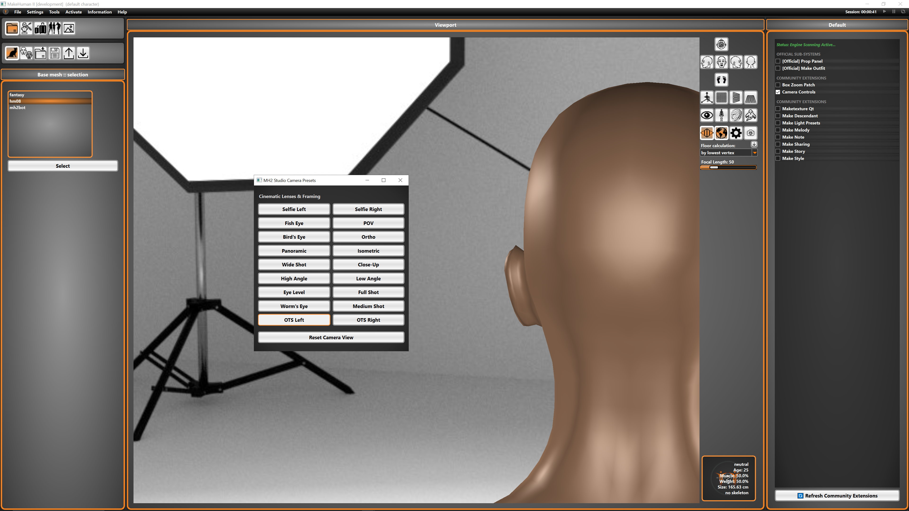

# MH_2_Camera_Controls   
   
 
This is a simple patch to allow for Box/Marqee style zoom in MH2 utilizing the official Plugin gateway.    
This now also includes a camera suite!  
  
Enable in the plugin panel official extensions after opening up community plugin panel. This plugin requires the MH2    
or Makehuman 2 Official plugin panel version and up in order to load.  (ensure you have the most relevant init).  

To use the box zoom hold shift and click and drag the mouse in a box shape in order to zoom to what is in said box.  
  
To utilize the rest of the camera controls simply click the button according to your choice of view, and reset where is  
necessary.  
